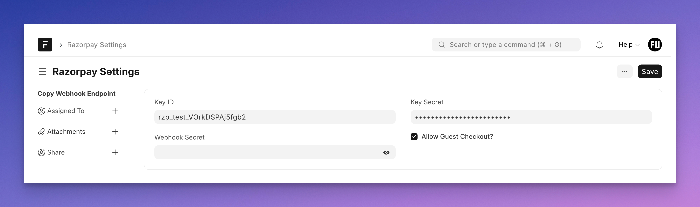
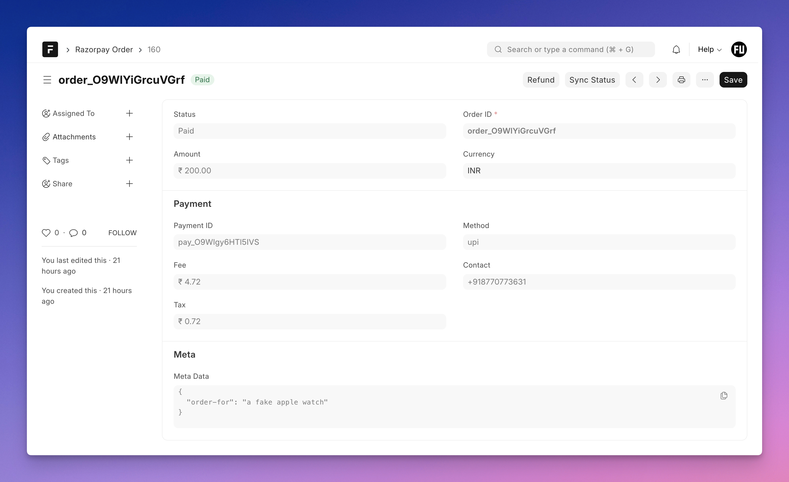

### Razorpay Integration for your custom Apps


## Introduction

I have built a Razorpay Integration from scratch 4 times till now (for Frappe Cloud, e-book Store series, Printrove Integration and FOSS United Platform). I *don't want to write Razorpay Integration from scratch* ever again!

Let me show you the process of leveraging this app in your custom app or even in the customization layer (using server scripts).

## 1. Installation

You can install this app using the [bench](https://github.com/frappe/bench) CLI:

```bash
cd $PATH_TO_YOUR_BENCH
bench get-app $URL_OF_THIS_REPO --branch main
bench --site $SITE_NAME install-app razorpay_frappe
```

## 2. Configuration

Open up `Razorpay Settings` and add your API keys:



You can also **toggle guest checkout from here**. If you disable guest checkout, the API endpoints for working with Razorpay orders (more soon) will need authentication.

### Setting Up Webhooks

From your Razorpay dashboard, add a new webhook with the following events:

1. `payment.captured`
1. `payment.failed`
1. `refund.processed`

You can copy the webhook endpoint using the **Copy Webhook Endpoint** link in the sidebar. Make sure you set the same webhook secret in the settings as you have given during webhook setup in Razorpay dashboard.

## 3. Accepting Payments / Checkout from Frontend

https://github.com/BuildWithHussain/razorpay_frappe/assets/34810212/8a095fd9-32fa-47e1-9cf0-76c22c7a4e4b

The backend is already ready ⚡. For the frontend, I have included 2 ready to go examples:

1. Portal Page with VanillaJS ([source](./examples/checkout.html))
1. FrappeUI Page with Vue Headless component ([source](./examples/FrappeUICheckout.vue))

The nice thing about the second example is that you can just copy the `RazorpayHeadlessCheckout` ([source](./examples/RazorpayHeadlessCheckout.vue)) component to your FrappeUI based frontend and it will just work!

### API Endpoints

This app brings in the below API endpoints that are used in the above examples:

1. **/razorpay-api/initiate-order** creating a new order

2. **/razorpay-api/success-handler**: handle payment success

3. **/razorpay-api/failure-handler**: handle payment failed

4. **/razorpay-api/webhook-handler**: handle webhooks from Razorpay

You can checkout `rzp_renderer.py` file to see how these work.

## 4. Hooking into the Payment Flow

All of the payment tracking happens in the `Razorpay Order` DocType:



You can hook into document lifecycle events (`before_insert`, `on_update`, etc.) of this DocType to extend/add your own logic. Here is an example using `doc_events` hook in our custom app:

```py
# hooks.py
#--------

doc_events = {
    "Razorpay Order": {
        "on_update": "path.to.method.process_payment_update"
    }
}

# method
def process_payment_update(doc, event):
    if doc.has_value_changed("status") and doc.status == "Paid":
        meta_data = frappe.parse_json(doc.meta_data)
        # create tickets, sales invoice, etc.
        # ...
```

You can do the same thing using `Server Script` (Document Event) as well.

## Contributing

This app uses `pre-commit` for code formatting and linting. Please [install pre-commit](https://pre-commit.com/#installation) and enable it for this repository:

```bash
cd apps/razorpay_frappe
pre-commit install
```

Pre-commit is configured to use the following tools for checking and formatting your code:

- ruff
- eslint
- prettier
- pyupgrade

### CI

This app can use GitHub Actions for CI. The following workflows are configured:

- CI: Installs this app and runs unit tests on every push to `develop` branch.
- Linters: Runs [Frappe Semgrep Rules](https://github.com/frappe/semgrep-rules) and [pip-audit](https://pypi.org/project/pip-audit/) on every pull request.

### License

mit
